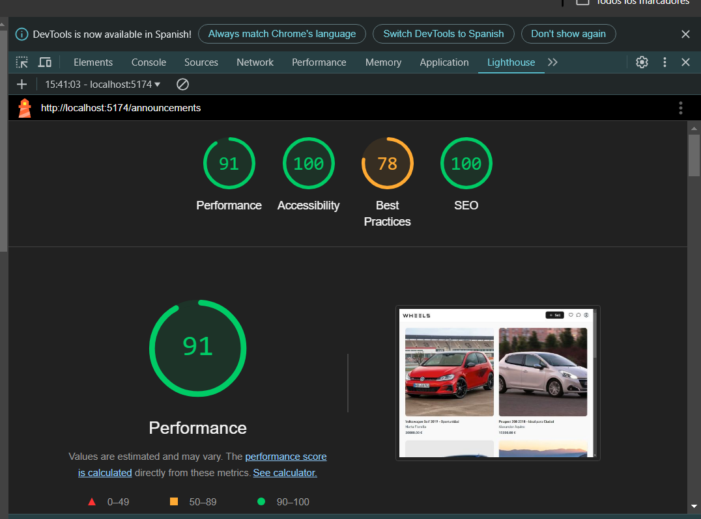

# Evaluación de Accesibilidad y Usabilidad en el Desarrollo Web

## Fases de la Actividad

### 1. Preparación

#### Tareas a Probar:

- **Publicar un anuncio:** Acceder al formulario de anuncio haciendo clic en el botón "Sell" ubicado en el encabezado.
- **Agregar un favorito y consultar la lista de favoritos:** Acceder a los detalles de un anuncio, agregarlo como favorito y luego ver la lista de favoritos.
- **Dejar una opinión a un usuario:** Acceder al perfil de un usuario e identificar el botón para dejar una opinión.

#### Verificación de Accesibilidad:

Utilizar herramientas como Wave o la herramienta de auditoría de accesibilidad de Chrome DevTools para identificar problemas técnicos de accesibilidad (por ejemplo, contraste de colores, etiquetas ARIA, etc.).

---

### 2. Realización de Pruebas con Usuarios

#### Selección de Usuarios:

- **Usuario 1 (Amigo):** Familiarizado con la tecnología.
- **Usuario 2 (Primo):** Medianamente familiarizado con la tecnología.
- **Usuario 3 (Abuelo):** No familiarizado con la tecnología.

#### Ejecución de las Pruebas:

##### Usuario 1: Familiarizado con la tecnología

| Tarea                                    | Tiempo       | Problemas |
| ---------------------------------------- | ------------ | --------- |
| Publicar un anuncio                      | 1:00 minutos | Ninguno   |
| Agregar un favorito y consultar la lista | 0:55 minutos | Ninguno   |
| Dejar una opinión a un usuario           | 0:40 minutos | Ninguno   |

---

##### Usuario 2: Medianamente familiarizado con la tecnología

| Tarea                                    | Tiempo       | Problemas                                                                      |
| ---------------------------------------- | ------------ | ------------------------------------------------------------------------------ |
| Publicar un anuncio                      | 1:20 minutos | Intentó seleccionar el modelo de vehículo sin antes haber seleccionado el año. |
| Agregar un favorito y consultar la lista | 1:00 minutos | Se tardó un poco en encontrar cómo acceder a la lista de favoritos.            |
| Dejar una opinión a un usuario           | 1:10 minutos | Buscaba el botón para dejar una reseña en la página de detalles del anuncio.   |

**Feedback:**  
Sugirió que el botón para dejar una opinión o reseña al usuario también esté en la página de detalles del anuncio para que no haga falta ir al perfil del usuario.

---

##### Usuario 3: No familiarizado con la tecnología

| Tarea                                    | Tiempo       | Problemas                                                                                       |
| ---------------------------------------- | ------------ | ----------------------------------------------------------------------------------------------- |
| Publicar un anuncio                      | 1:50 minutos | - No identificaba el botón para subir un anuncio ya que estaba en inglés.                       |
|                                          |              | - Al publicar el anuncio no hubo ningún mensaje de confirmación y pensó que no se había subido. |
| Agregar un favorito y consultar la lista | 1:20 minutos | Se tardó en ubicar cómo acceder a la lista de favoritos.                                        |
| Dejar una opinión a un usuario           | 1:40 minutos | Se tardó en acceder al perfil del usuario haciendo clic en la tarjeta del anunciante.           |

**Feedback:**  
Sugirió que la página esté en castellano para que sea más fácil de acceder para las personas que hablen castellano y no estén familiarizadas con el inglés. También sugirió que al subir un anuncio apareciera un mensaje para indicar al usuario que su anuncio fue subido.

---

### 3. Análisis y Propuesta de Mejoras

Basado en los resultados recogidos de los usuarios, se podrían mejorar los siguientes aspectos:

- En el header, al añadir un favorito, marcar el icono con algún punto para indicar que hay un nuevo favorito añadido.
- Colocar el botón para dejar reseñas a un usuario en la página de detalles del anuncio del usuario, simplificando así la navegación para que no haga falta ir al perfil del usuario para dejar una reseña u opinión.
- Implementar una versión en castellano de la página para mejorar la accesibilidad para usuarios hispanohablantes.
- Añadir un mensaje de confirmación después de publicar un anuncio para que el usuario sepa que se ha subido correctamente.
- Añadir validacion de errores o de campos vacios en tiempo real en el multi step form para subir un anuncio.
